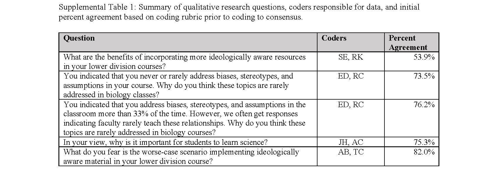
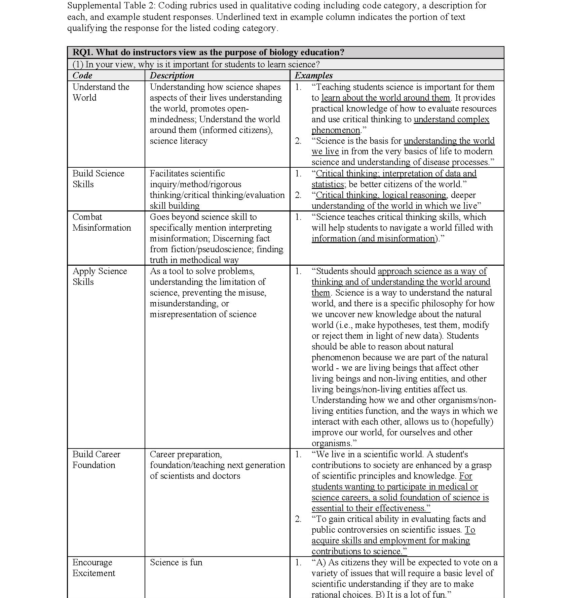
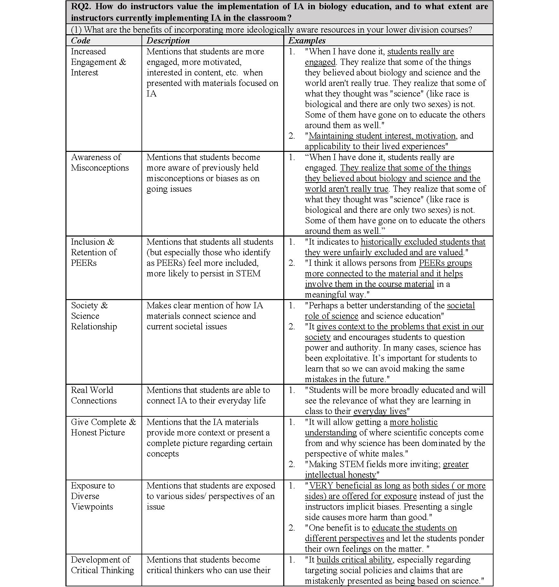
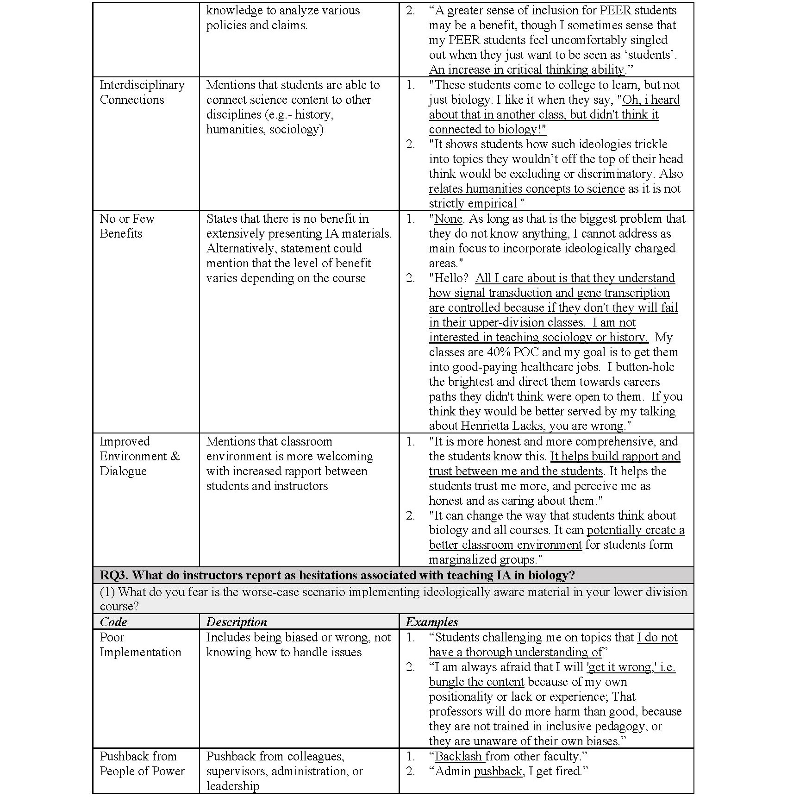
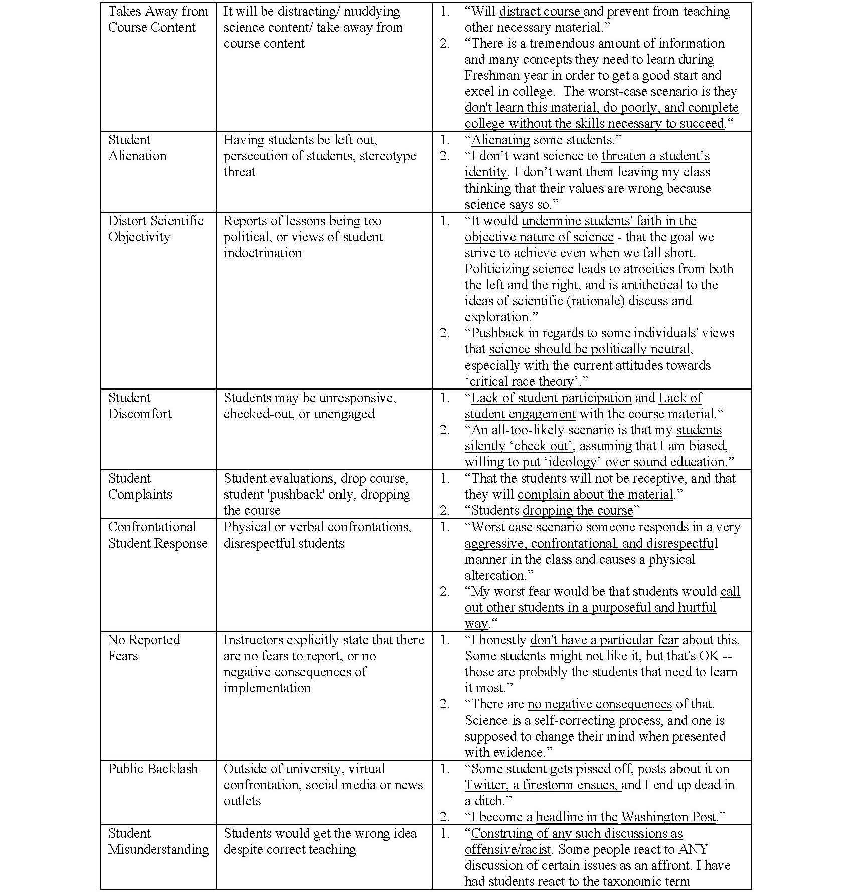
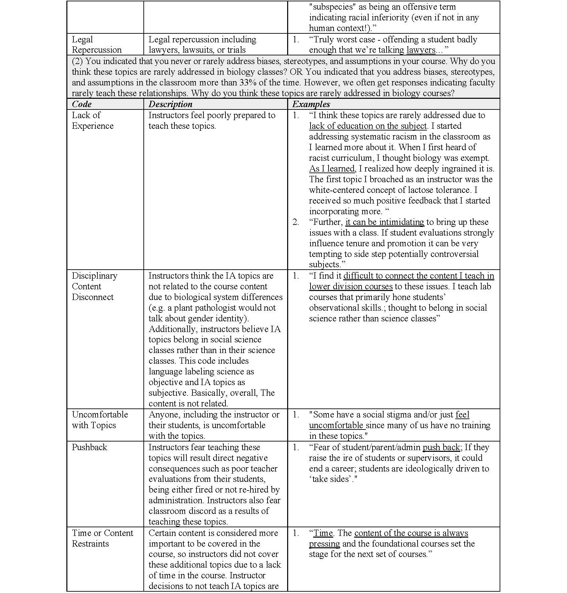
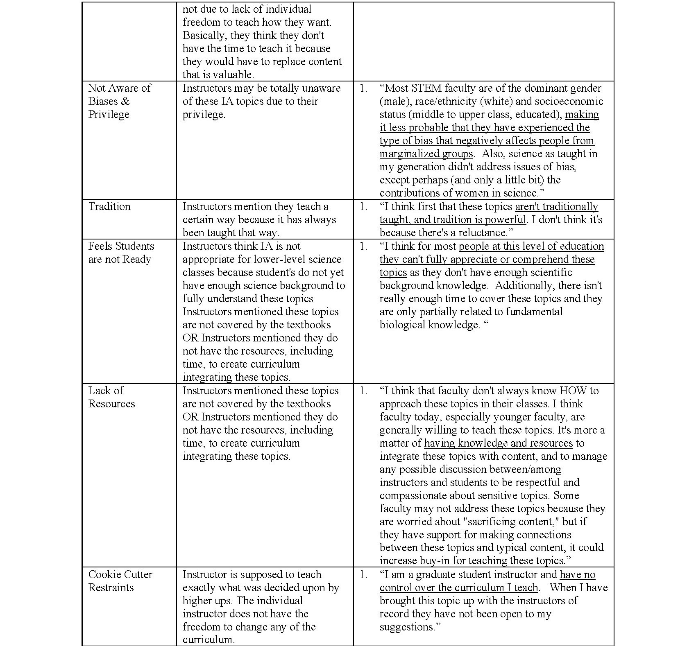

# How and why instructors discuss controversial topics in biology.
 
Abby E. Beatty, Jeremiah Henning, Emily P. Driessen, Amanda D. Clark, Robin Costello, Sharday Ewell, Randy Klabacka, Todd Lamb, Kimberly Mulligan, Sheritta Fagbodum, & Cissy J. Ballen  

*Corresponding author: aeb0084@auburn.edu

This repository holds all supplemental materials for "How and why instructors discuss controversial topics in biology".

## Abstract: 

"Traditional biology curricula depict science as an objective field, overlooking the important influence that human values and biases have on what is studied and who can be a scientist. We can address this shortcoming by incorporating Ideological Awareness (IA) into the curriculum, which is an understanding of biases, stereotypes, and assumptions that shape contemporary and historical science. We surveyed a national sample of lower-level biology instructors to determine their views of the (1) purpose of biology education, (2) value of IA in biology, and (3) hesitations to teaching IA in biology. Most instructors reported that “understanding the world” was the main goal of biology education. Despite the perceived benefits of IA, such as increasing student engagement and dispelling misconceptions, instructors were hesitant to implement IA modules due to potential professional consequences. We address how instructor values, purpose, and hesitancies affect teaching practices, and propose systemic approaches to increasing instructor support."

### Quick Key to File Directory: Detailed Descriptions of file use can be found below.

Note: The final data set used in analysis is available for public use. Additionally, deidentified raw survey data is available here. Due to IRB Restrictions all data files used in analysis that contain institutional information prior to the final merged and deidientified data are available upon direct request. Following approval, all deidentified data including institutional info will be shared directly.

Analysis and File Names| Brief Description | Link to File
-------------------------------------|------------------------------------ | -----------------------------------------------------
Suvey Instrument            | Survey given to participants |   [Survey File]("National Survey.pdf")
Final Data File            | Final data file used in survey analysis |   [Deidentified Data File]()

## Supplemental Tables

## Statistical and Data Visualization Code

